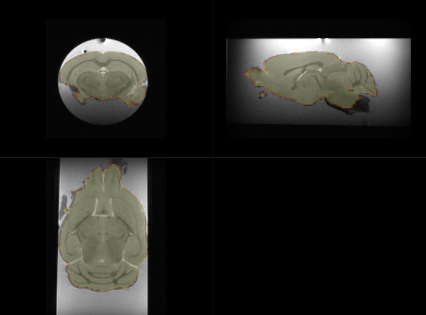
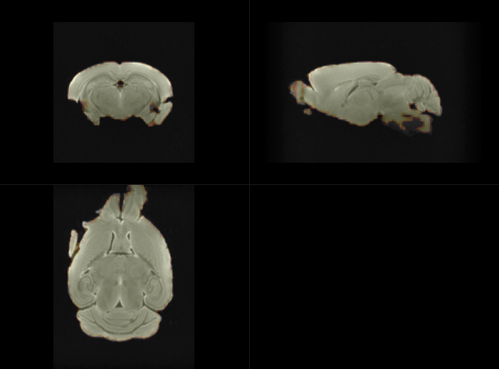
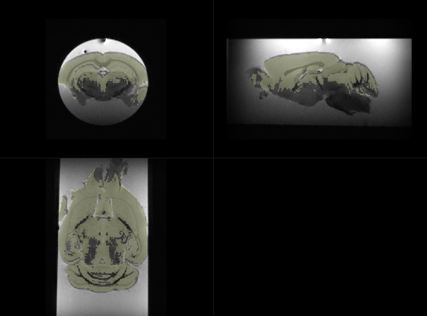

# Skull Stripping pour TractoFlow 

## Objectif/Description du projet

Segmenter de manière automatique le cerveau

## Listes des tâches

- [TODO] il y a encore un problème avec les strides .... à relancer
- [TODO] il faudra affiner les segmentations et reboucher certains trous
- [TODO] relancer le modèle à la résolution d'origine
- [TODO] ajouter le dockerfile
- [TODO] creer un entrypoint
- [TODO] trouver un endroit au stocker les données en ligne 
- [TODO] (accessoire) trouver pourquoi le jeux de données Sans Gado est corrompu.

## Methodes

Plusieurs apprentissages ont été généré avec un reseau Unet en fonction des scripts de préprocessing.

### 1) Pré-traitement

* dwidenoise (de MRtrix) (obligatoire ou alternative similaire)
 Denoising is essential for robust segmentation. 

* un double filtre N4 (de ants) (surement obligatoire à terme) 

The protocol IRM utilisé ici diffère largement des protocols de diffusion sur volontaires qui sont extrement standardisés.
En particulier les antennes têtes vont générer un biais d'intensité et niveau de bruit relativement proche quelque soit le scanner utilisé.
Ici, les conditions sont très différentes, le parc de scanner, ou d'antennes est moins homogène, on aura parfois recours à une antenne de surface parfois à une antenne volumique, la position de l'antenne par rapport à l'échantillon est relative à l'utilisateur et enfin la découpe est aussi utilisateur dépendant.
En conséquence, les biais d'intensité risque de varier fortement d'une acquisition à l'autre. Pour pallier à ce problème, l'utilisation d'un filtre N4 est recommandé.
Le filtre N4 est appliqué, (c'est une habitude perso sur les donnes ex-vivo).

* downsampling (optionnel)

C'est uniquement pour gagner du temps, il faudrait plutôt faire un upsampling pour améliorer la précision de la segmentation.

* segmentation

[TODO] il faudra affiner les segmentations et reboucher certains trous.

### 2) Apprentissage

le script d'apprentissage a été gracieusement fourni par Nick Tustison.

en entrée N=8 de `S#1` à `S#8` échantillons

* soit les b0 individuels ( N=5*8=40) named as `individual b0`
* soit les b0 moyenné (N=1*8=8) named as `mean b0`
* soit les dw moyenné (N=1*8=8) named as `mean dw`

soit 3 apprentissages *2 pour avec `Gado` et `Sans Gado`.
et l'apprentissage avec ou sans `N4` 

[IMPORTANT] le nombre de donnée est vraiment très sous-optimal. 
Il sera nécessaire d'intégrer des données d'un autre site et d'un autre scanner pour espèrer un minimum de robustesse. 

### 3) Prédiction 

en test N=1 avec `S#9` a été utilisé.

## Résultats

### Apprentissage 

Légende: Loss fonction as function of epochs (Left), Dice as function of epochs (middle), Ignore (Right)

A) Résultats typique pour le jeux de données avec gado, on obtient un dice porche de 1.00.

B) Le jeux de données Sans Gado contient une image / une donnée corrompue. Il faut trouver laquelle.

###  Prédiction

Légende: Magnitude image with brain probability mask [0:1] overlayed with a cutoff at 0.5.

A) Model `individual b0` 

B) Model `mean b0 + N4`

C) Model `mean dw + N4`

d) Gold Standard

Le dice est disponible dans le dossier Table pour chaque model
Attention le masque dit Gold Standard est complètement faux. Donc pour l'instant il ne faut pas tenir compte du Dice mais il sera calculé

#### Deploiement

Image docker avec un entrypoint 

* entrée : image de diffusion 4D
* sortie : mask ou mask de probabilité

