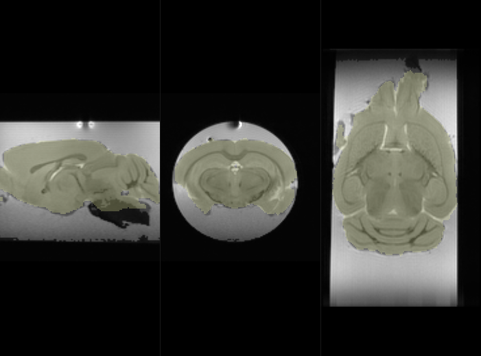

# Skull Stripping pour TractoFlow 

## Objectif/Description du projet

Segmenter de manière automatique le cerveau

## Conclusion

Les résultats semblent acceptables, de nombreuses améliorations sont possibles. 
Le dépot permettra de suivre cela.
La fiabilité de l'apprentissage sera néanmoins faible (du moins c'est fort probable) en raison d'une très faible variabilité des données d'entrée.

## Listes des tâches

- [en cours] il y a encore un problème avec les strides .... c'est maintenant corrigé
- [TODO] (accessoire) il faudrait affiner les segmentations et reboucher certains trous 
- [TODO] relancer le template à la résolution d'origine
- [TODO] relancer le modèle à la résolution d'origine
- [TODO] ajouter le dockerfile
- [TODO] creer un entrypoint
- [TODO] trouver un endroit au stocker les données en ligne 
- [TODO] (accessoire) trouver pourquoi le jeux de données Sans Gado est corrompu.

## Portofolio des données d'entrée

Legende: Magnitude image overlayed with a label mask (hand made)

S#1 

S#4

S#8

## Methodes

Plusieurs apprentissages ont été générés avec un reseau Unet en fonction des scripts de préprocessing.

### 1) Pré-traitement

* dwidenoise (de MRtrix) (obligatoire ou alternative similaire)
 Denoising is essential for robust segmentation. 

* un double filtre N4 (de ants) (surement obligatoire à terme) 

The protocol IRM utilisé ici diffère largement des protocols de diffusion sur volontaires qui sont extrement standardisés.
En particulier les antennes têtes vont générer un biais d'intensité et niveau de bruit relativement proche quelque soit le scanner utilisé.
Ici, les conditions sont très différentes, le parc de scanner, ou d'antennes est moins homogène, on aura parfois recours à une antenne de surface parfois à une antenne volumique, la position de l'antenne par rapport à l'échantillon est relative à l'utilisateur et enfin la découpe est aussi utilisateur dépendant.
En conséquence, les biais d'intensité risque de varier fortement d'une acquisition à l'autre. Pour pallier à ce problème, l'utilisation d'un filtre N4 est recommandé.
Le filtre N4 est appliqué, (c'est une habitude perso sur les donnes ex-vivo).

un example est la présence d'eau sur cette image , il n'est pas certain que le volume ou la forme soit similaire suivant la préparation, typiquement ici le cerveau touche la paroi du tube.

* downsampling (optionnel)

C'est uniquement pour gagner du temps, il faudrait plutôt faire un upsampling pour améliorer la précision de la segmentation.

* segmentation

[TODO] il faudra affiner les segmentations et reboucher certains trous.

* on crée rapidement un premier template dossier `template_64_first`, ensuite on l'aligne normalement en estimant la transformation sous itksnap `template_64_initial`  puis on recalcule un second template sur celui ci `template_64` pour obtenir un template de reférence pour chaque model.

### 2) Apprentissage

le script d'apprentissage a été gracieusement fourni par Nick Tustison.

en entrée N=8 de `S#1` à `S#8` échantillons

* soit les b0 individuels ( N=5*8=40) named as `individual b0`
* soit les b0 moyenné (N=1*8=8) named as `mean b0`
* soit les dw moyenné (N=1*8=8) named as `mean dw`

soit 3 apprentissages *2 pour avec `Gado` et `Sans Gado`.
et l'apprentissage avec ou sans `N4` 

[IMPORTANT] le nombre de donnée est vraiment très sous-optimal. 
Il sera nécessaire d'intégrer des données d'un autre site et d'un autre scanner pour espèrer un minimum de robustesse. 

### 3) Prédiction 

en test N=1 avec `S#9` a été utilisé.
on obtient un mask de probabilité entre 0 et 1 sur lequel on applique

* la fonction ThresholdImage entre 0.5 et 1 , à affiner
* la fonction GetLargestComponent : Get the largest object in an image  sur le mask final, pour supprimer l'existence de résidu en dehors du cerveau

## Résultats

### Apprentissage 

Légende: Loss fonction as function of epochs (Left), Dice as function of epochs (middle), Ignore (Right)

A) Résultats typique pour le jeux de données avec gado, on obtient un dice porche de 1.00.

B) Le jeux de données Sans Gado contient une image / une donnée corrompue. Il faut trouver laquelle.

### Prédiction

Légende: Magnitude image with final label mask as overlay

A) Model `individual b0` 

B) Model `mean b0 + N4`

C) Model `mean dw + N4`

d) Gold Standard

Le dice est disponible dans le dossier Table pour chaque model. Attention le masque dit Gold Standard est complètement faux. Donc pour l'instant il ne faut pas tenir compte du Dice mais il sera calculé.

### Deploiement

Image docker avec un entrypoint 

* entrée : image de diffusion 4D
* sortie : mask ou mask de probabilité

